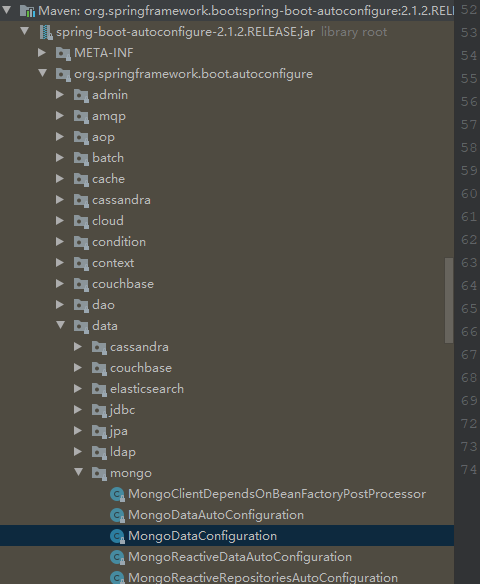
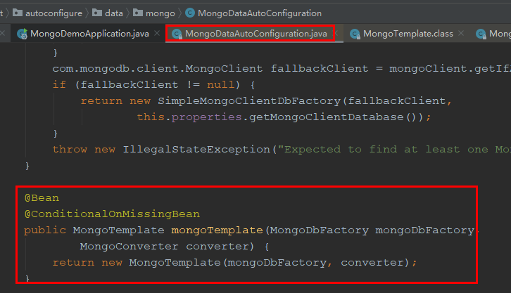
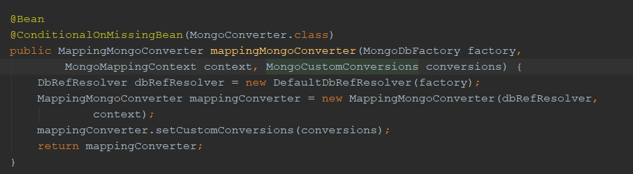
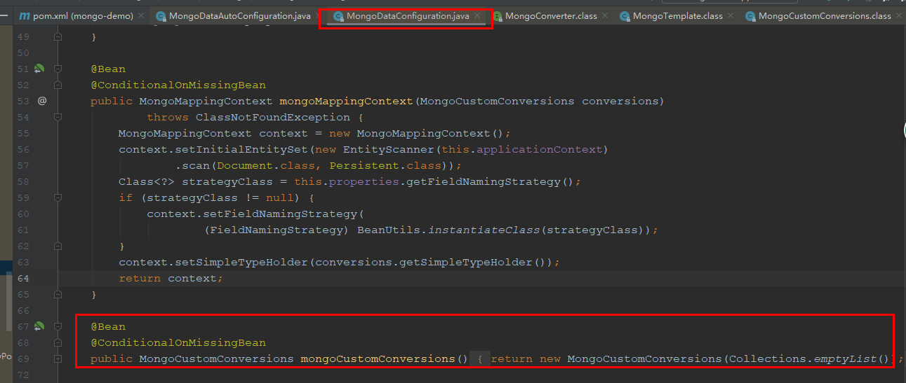

## 集成MongoDB

### pom文件

```pom
<dependencies>
		<dependency>
			<groupId>org.springframework.boot</groupId>
			<artifactId>spring-boot-starter-data-mongodb</artifactId>
		</dependency>

		<dependency>
			<groupId>org.joda</groupId>
			<artifactId>joda-money</artifactId>
			<version>RELEASE</version>
		</dependency>

		<dependency>
			<groupId>org.projectlombok</groupId>
			<artifactId>lombok</artifactId>
			<optional>true</optional>
		</dependency>
		<dependency>
			<groupId>org.springframework.boot</groupId>
			<artifactId>spring-boot-starter-test</artifactId>
			<scope>test</scope>
		</dependency>
	</dependencies>

	<build>
		<plugins>
			<plugin>
				<groupId>org.springframework.boot</groupId>
				<artifactId>spring-boot-maven-plugin</artifactId>
			</plugin>
		</plugins>
	</build>
```
### springboot-configure





如果想自定义一些spring组件，可以先打开springboot自动配置，看一下配置有没有口子可以自定义Bean
